<!--
  DRAFT README. Assets marked TODO(asset) do not exist yet:
  - examples/screenshots/teach.gif (or a video uploaded to GitHub)
  - the GitHub Pages gallery (https://mperlak.github.io/letterhead/)
-->

<h1>
  <picture>
    <source media="(prefers-color-scheme: dark)" srcset="examples/screenshots/hero-before-after-dark.webp">
    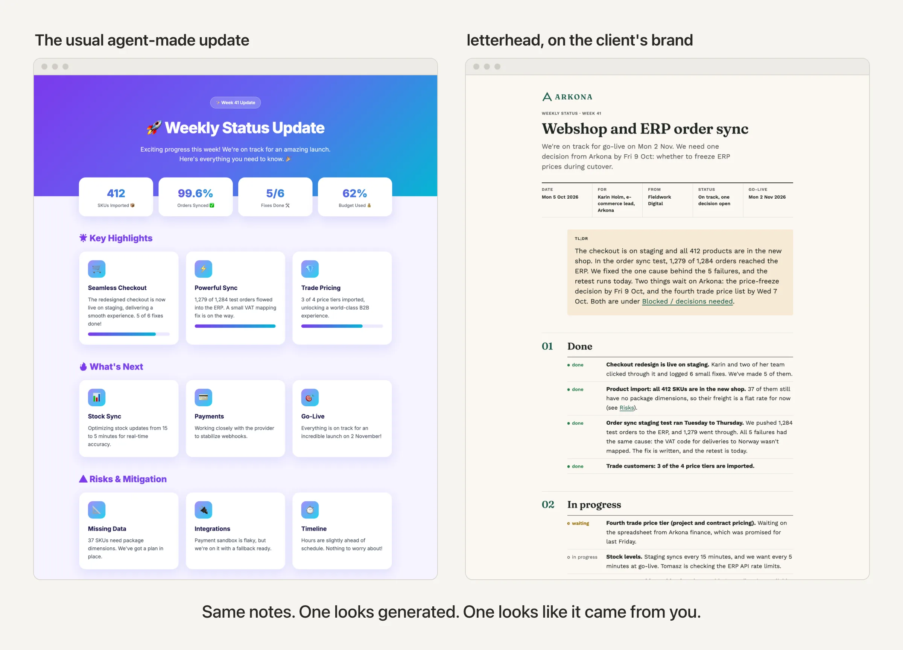
  </picture>
</h1>

**Your agent writes the document. letterhead puts it on your client's letterhead.**

A skill for Claude Code, Codex, Cursor and other coding agents. It turns
notes, a repo or a conversation into a self-contained HTML document for
someone outside your team: a client, a boss, a board. The plan, the status
update, the proposal comes out in their brand (or yours), reads well on a
phone, and is built to collect comments and come back as version two.

No Figma, no template hunting, and no "this was clearly written by a bot" moment
when the client opens it.

<!-- TODO(asset): https://mperlak.github.io/letterhead/ -->
**[Browse the live gallery →](https://mperlak.github.io/letterhead/)** 12 templates × 9 styles, light and dark.

---

## Install

**Claude Code**

```text
/plugin marketplace add mperlak/letterhead
/plugin install letterhead@letterhead
```

To get updates automatically, run `/plugin`, open **Marketplaces**, select
**letterhead** and choose **Enable auto-update** (Claude Code leaves it off
for third-party marketplaces).

**Codex**

```bash
codex plugin marketplace add mperlak/letterhead
codex plugin add letterhead@letterhead
```

**Cursor, OpenCode and other Agent Skills hosts**

```bash
npx skills add mperlak/letterhead
```

Or clone the repo and point your agent at `skills/letterhead/`. The scripts
need Node.js and nothing else.

## Quick start

Talk to your agent the way you would talk to a colleague. The skill loads on
its own when you ask for a document or mention a brand.

```text
> learn the brand of https://arkona.example, it's my client
> make a status update for Arkona from NOTES.md
> polish status-update.html
```

1. **Brand, about two minutes.** The agent reads the site, proposes a profile
   (primary color, fonts, logo, closest style) and waits for your yes. Then
   it writes the profile and opens a one-page **brand sheet**.
2. **Document.** Before writing any HTML, the agent shows the shape: which
   template, which brand, the sections in order, what the first two phone
   screens say. You say yes, change it, or say no.
3. **Done.** One `.html` file, both themes inside, opens offline with a
   double-click.

You can also call the skill directly: `/letterhead teach`, `/letterhead
polish <file>`, `/letterhead publish <file>` (when installed as a plugin in
Claude Code, the prefix is `/letterhead:letterhead`).

<!-- TODO(asset): 60–90 s screen recording: URL → brand sheet → status update → a comment → version 2 at the same link. -->

## Why I built it

<!-- TODO(marcin): rewrite in your own words; this is a placeholder of the facts. -->

I run an interior design studio and build a review tool on the side. Every
week an agent writes something for me that goes to a client: a project plan,
a status update, a proposal, a presentation of a room. The content was fine.
The look was always the same: Inter, a purple accent, three cards with icons.
The client could tell, and every time I fixed it by hand or sent it anyway.

So I taught my agent one brand per client, once, and made every document
follow it. letterhead is that skill, cleaned up.

## What it makes

Twelve templates, one per thing a client actually receives:

| Template | Use it for |
|---|---|
| `implementation-plan` | how a piece of work will be done, step by step |
| `status-update` | where a project stands this week |
| `spec` | what will be built, for sign-off |
| `proposal` | an offer: scope, price, timeline |
| `report` | findings with evidence |
| `audit` | what was checked, what failed, what to fix |
| `project-recap` | what was delivered, at the end |
| `release-notes` | what changed in this version |
| `checklist` | steps someone else will tick off |
| `postmortem` | what went wrong and what changes now |
| `change-walkthrough` | a change explained to a non-author |
| `presentation` | a project shown picture by picture: rooms, variants, the products used |

Nine styles, chosen by who reads the document: `boardroom`, `engineering`,
`corporate`, `startup`, `consulting`, `public-sector`, `workshop`,
`atelier` (a small business writing to private customers) and `gazette`.
A style only sets layout and rhythm. Colors, fonts and logo always come from
the brand.

Ten documents for four fictional companies, each made by the skill from
short notes, unedited:

<table>
  <tr>
    <td align="center" width="33%">
      <a href="https://mperlak.github.io/letterhead/documents/proposal--halde.html"><picture>
        <source media="(prefers-color-scheme: dark)" srcset="examples/screenshots/proposal--halde-dark.webp">
        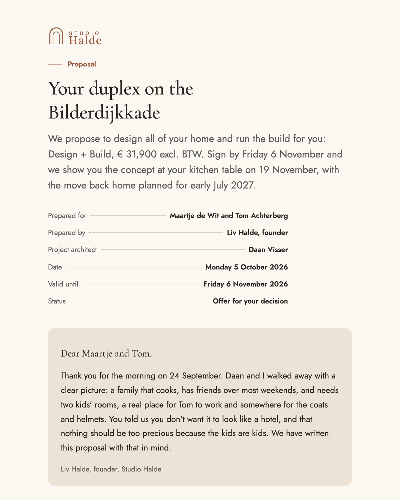
      </picture></a><br>
      <b>Proposal with packages and prices</b><br>
      <sub>Studio Halde · interior studio to a private client · atelier</sub>
    </td>
    <td align="center" width="33%">
      <a href="https://mperlak.github.io/letterhead/documents/report--halde.html"><picture>
        <source media="(prefers-color-scheme: dark)" srcset="examples/screenshots/report--halde-dark.webp">
        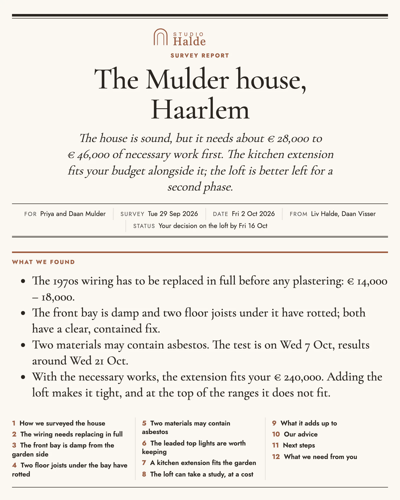
      </picture></a><br>
      <b>Site survey report</b><br>
      <sub>Studio Halde · findings and a € range · gazette</sub>
    </td>
    <td align="center" width="33%">
      <a href="https://mperlak.github.io/letterhead/documents/status-update--arkona.html"><picture>
        <source media="(prefers-color-scheme: dark)" srcset="examples/screenshots/status-update--arkona-dark.webp">
        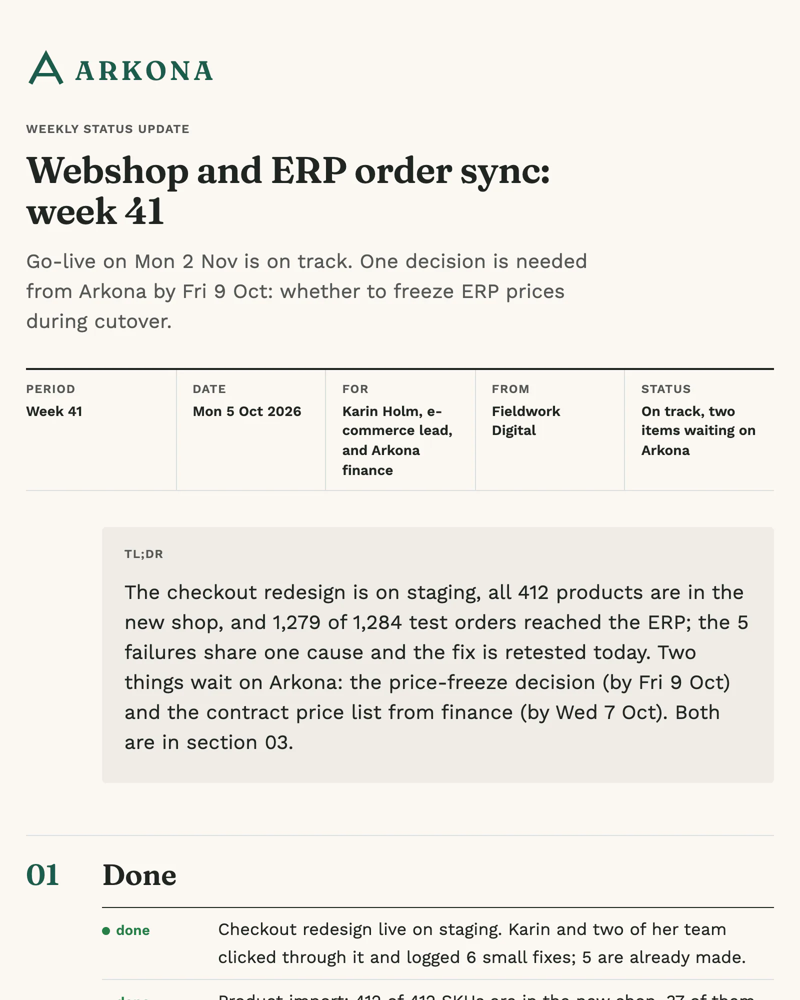
      </picture></a><br>
      <b>Weekly status update</b><br>
      <sub>Arkona, written by its agency · consulting</sub>
    </td>
  </tr>
  <tr>
    <td align="center" width="33%">
      <a href="https://mperlak.github.io/letterhead/documents/proposal--fieldwork.html"><picture>
        <source media="(prefers-color-scheme: dark)" srcset="examples/screenshots/proposal--fieldwork-dark.webp">
        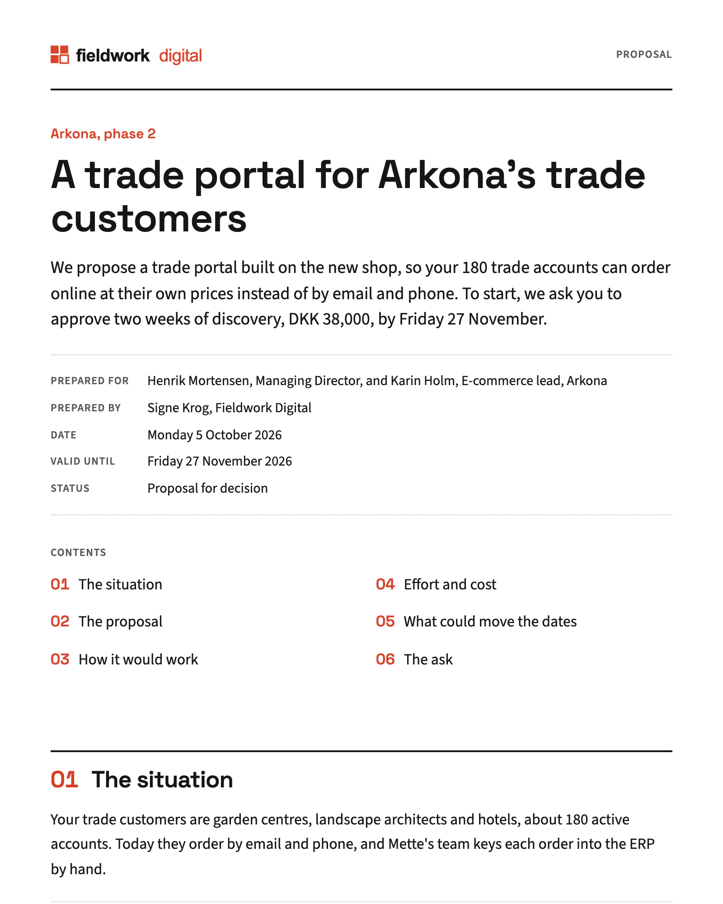
      </picture></a><br>
      <b>Fixed-price proposal</b><br>
      <sub>Fieldwork Digital · agency to a client · consulting</sub>
    </td>
    <td align="center" width="33%">
      <a href="https://mperlak.github.io/letterhead/documents/project-recap--fieldwork.html"><picture>
        <source media="(prefers-color-scheme: dark)" srcset="examples/screenshots/project-recap--fieldwork-dark.webp">
        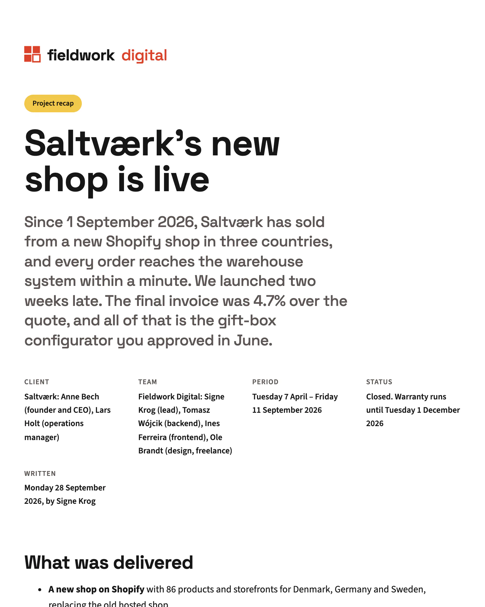
      </picture></a><br>
      <b>Project recap</b><br>
      <sub>Fieldwork Digital · results at the end · startup</sub>
    </td>
    <td align="center" width="33%">
      <a href="https://mperlak.github.io/letterhead/documents/checklist--arkona.html"><picture>
        <source media="(prefers-color-scheme: dark)" srcset="examples/screenshots/checklist--arkona-dark.webp">
        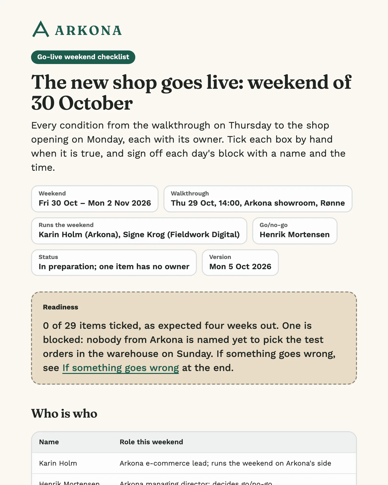
      </picture></a><br>
      <b>Go-live weekend checklist</b><br>
      <sub>Arkona · owners and sign-offs · workshop</sub>
    </td>
  </tr>
  <tr>
    <td align="center" width="33%">
      <a href="https://mperlak.github.io/letterhead/documents/spec--kestrel.html"><picture>
        <source media="(prefers-color-scheme: dark)" srcset="examples/screenshots/spec--kestrel-dark.webp">
        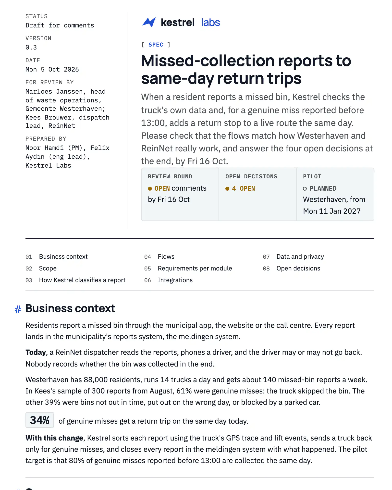
      </picture></a><br>
      <b>Product spec for sign-off</b><br>
      <sub>Kestrel Labs · B2B software · engineering</sub>
    </td>
    <td align="center" width="33%">
      <a href="https://mperlak.github.io/letterhead/documents/release-notes--kestrel.html"><picture>
        <source media="(prefers-color-scheme: dark)" srcset="examples/screenshots/release-notes--kestrel-dark.webp">
        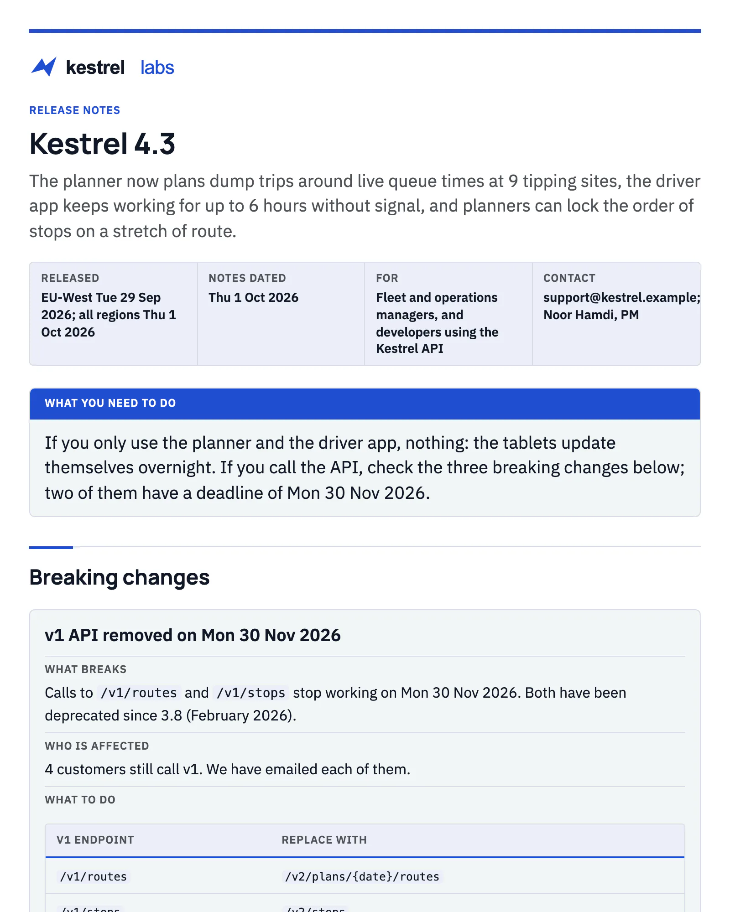
      </picture></a><br>
      <b>Release notes with breaking changes</b><br>
      <sub>Kestrel Labs · corporate</sub>
    </td>
    <td align="center" width="33%">
      <a href="https://mperlak.github.io/letterhead/documents/postmortem--kestrel.html"><picture>
        <source media="(prefers-color-scheme: dark)" srcset="examples/screenshots/postmortem--kestrel-dark.webp">
        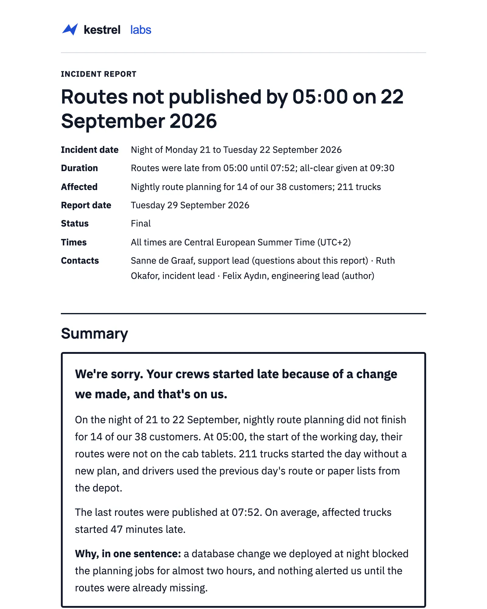
      </picture></a><br>
      <b>Incident postmortem for a client</b><br>
      <sub>Kestrel Labs · public-sector</sub>
    </td>
  </tr>
</table>

Every brand above was taught from its website in about a minute. The notes,
the prompts and the HTML of every document are in
[`examples/`](examples/).

## Teach it a brand

```text
You:    learn the brand of https://arkona.example
Agent:  → reads the page and its stylesheets
        → counts which colors sit on buttons, links and navigation
        → reads the font rules and saves the logo from the header
        → proposes: primary, fonts, logo, closest style, open questions
You:    yes, but use the dark logo
Agent:  → writes .letterhead/brands/arkona/ and opens the brand sheet
```

| Taken from | Becomes |
|---|---|
| colors used on buttons, links, navigation (counted, not guessed) | primary and accent |
| `font-family` rules on body and headings, with their weights | text and heading fonts |
| the logo in the site header, light or dark version | the logo on every document |
| how the site writes | voice notes in `PRODUCT.md` |

Every value records **where it came from and how sure the agent is**
(`profile.meta.json`). The agent never fills a gap with a random color.
When something is missing, it asks.

Besides a website, `teach` reads a brand book PDF, HTML files, design tokens
already in your repo, or a short interview.

**The brand sheet** is a one-page document showing the colors, fonts and
logo, with their sources and the agent's open questions. Send it to whoever
owns the brand before the first real document. It catches "that is not our
blue" before a twenty-page spec does.

<p align="center"><picture>
  <source media="(prefers-color-scheme: dark)" srcset="examples/screenshots/brand-sheet--halde-dark.webp">
  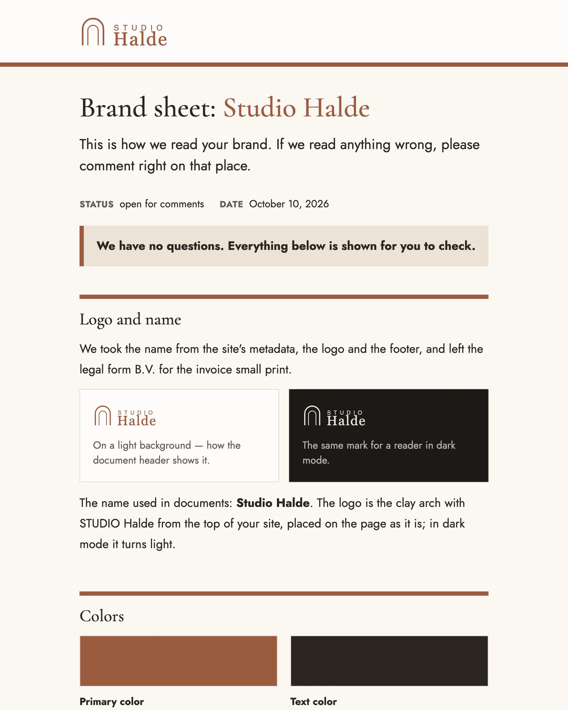
</picture></p>

**One profile per client.** Your own brand lives in `.letterhead/brand/`,
every other brand in `.letterhead/brands/<name>/`. Say "for Arkona" and the
document ships in Arkona's identity.

## Built to be commented on

A document for a client is a draft until they answer. letterhead makes every
document easy to review:

- every section heading gets a stable id derived from its text, so a comment
  on "Timeline" still points at "Timeline" in version two
- the title, date, owner and status are labeled fields, not decoration
- the file is self-contained: no build step, no external scripts, both
  themes inside

`/letterhead publish` sends a document to [Markloop](https://markloop.io),
which turns it into one link people comment on without an account. Your
agent pulls the comments and uploads the next version to the same link.
Markloop is a paid service from the author of this skill. You don't need it:
without it, letterhead gives you a plain HTML file you can share any way
you like.

## It's working if…

- Before writing HTML, the agent shows you the template, the brand, the
  sections and the first two phone screens, and waits for your yes.
- `teach` ends with a brand sheet on screen, and every color on it names its
  source.
- The document opens offline with a double-click and looks right on a phone,
  in light and in dark.
- `node <skill>/scripts/check-document.mjs <file>.html` reports no errors.
- No gradient text, no icon tile in front of every heading, no
  three-card grid, no "Generated by AI" footer.

If one of these fails, please [open an issue](https://github.com/mperlak/letterhead/issues).

## When not to use it

- **Slides for a talk.** Use a slides skill such as
  [frontend-slides](https://github.com/zarazhangrui/frontend-slides).
  letterhead's `presentation` template is for showing a project picture by
  picture, not for a keynote.
- **A diagram on its own.** Use
  [diagram-design](https://github.com/cathrynlavery/diagram-design).
- **A landing page or app UI.** That is a frontend job, not a document.
- **The recipient must edit a Word or PowerPoint file.** letterhead writes
  HTML.

## How it is checked

CI builds every template in every style (11 × 9 documents, plus the
presentation in all nine styles) and fails on any error from
`check-document.mjs`. Brand tokens are checked by `check-tokens.mjs`. Both
scripts ship with the skill, so your agent runs the same checks on your
documents.

## Contributing

Templates live in `letterhead/templates/<name>/template.md`, styles in
`letterhead/styles/<name>/`. Edit only `letterhead/`; `bin/sync-mounts.sh`
copies it to `skills/letterhead/`. [AGENTS.md](AGENTS.md) has the full
workflow.

## License

MIT. See [LICENSE](LICENSE) and [`letterhead/NOTICES.md`](letterhead/NOTICES.md).

---

Made by **Marcin Perlak**. <!-- TODO(marcin): link to X / site --> If
letterhead saved you an evening, **star the repo**. That is how other people
find it.
