# letterhead

Your agent's work, on your letterhead.

`letterhead` is a free, open-source skill for coding agents (Claude Code,
Cursor, Codex, and friends). It generates branded, self-contained HTML
documents meant for a human recipient: implementation plans, status updates,
specs, reports, proposals. Teach it your brand once (or a client's brand,
one profile per client) and every document comes out looking like it came
from that company. Documents are built to be commented on: comments
anchored to a section survive the next version.

## Install

```sh
npx skills add mperlak/letterhead
```

Or clone the repo and point your agent at the `letterhead/` directory.

## Quick start

```
/letterhead teach                       # build your brand profile (asks first, every step)
/letterhead a status update for the payments project
/letterhead an implementation plan from NOTES.md, for Acme   # client brand
/letterhead publish ./status-update.html                     # publish it for comments
```

The skill proposes a shape (template, brand, sections, mobile reading) and
waits for your yes before writing any HTML.

## What the documents look like

Generated examples live in [`examples/documents/`](examples/documents/),
with screenshots in [`examples/screenshots/`](examples/screenshots/).
Twelve templates ship with the skill (implementation-plan, status-update,
spec, proposal, report, audit, project-recap, release-notes, checklist,
postmortem, change-walkthrough, presentation) and nine
reference styles, organized by who receives the document: `boardroom`,
`engineering`, `corporate`, `startup`, `consulting`, `public-sector`,
`workshop`, `atelier` (a small business writing to private customers), and
`gazette` (the wildcard). Two taught brand profiles are
included as worked examples under [`examples/brands/`](examples/brands/).

All eight styles at a glance, each on a different template:

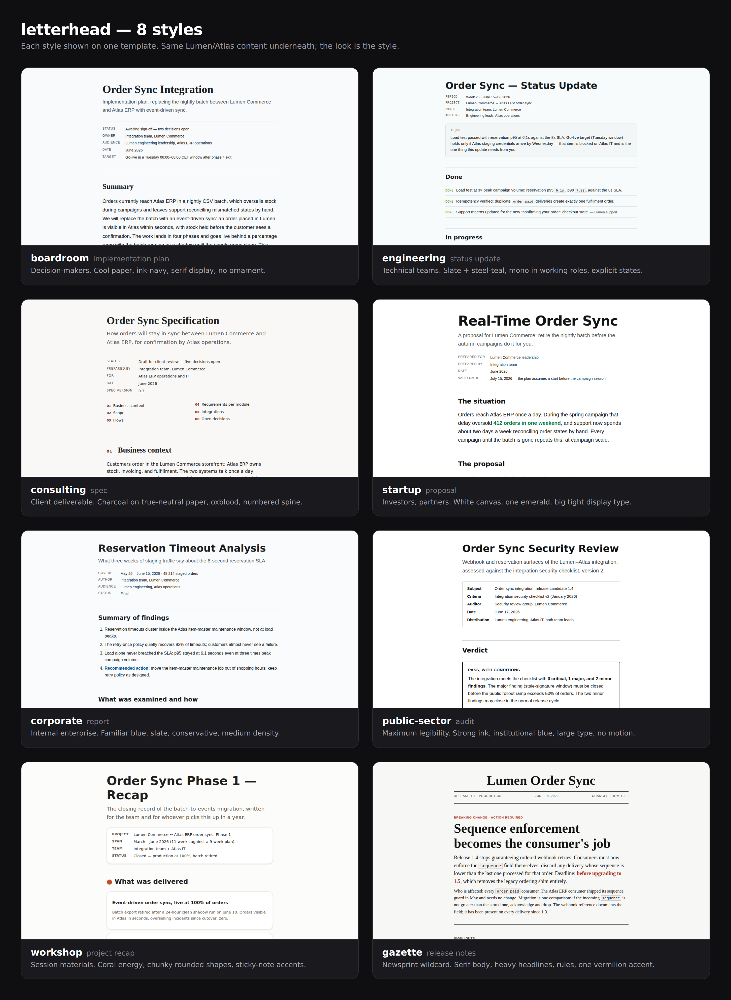

The individual documents, light and dark:

| | |
|---|---|
| 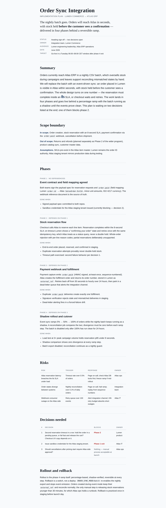 | 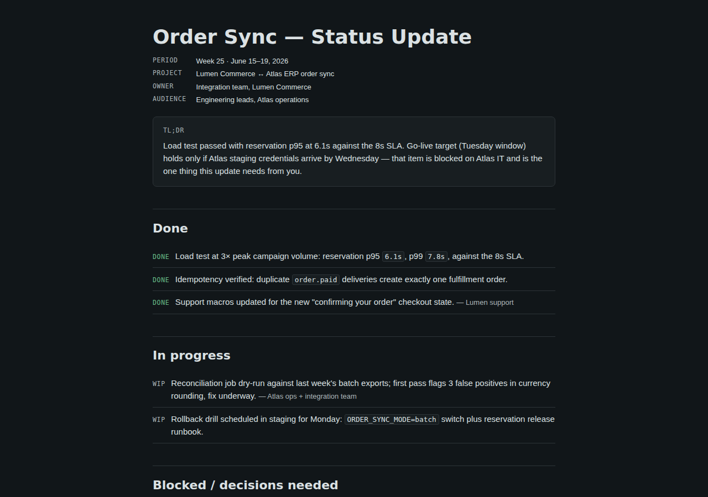 |
| 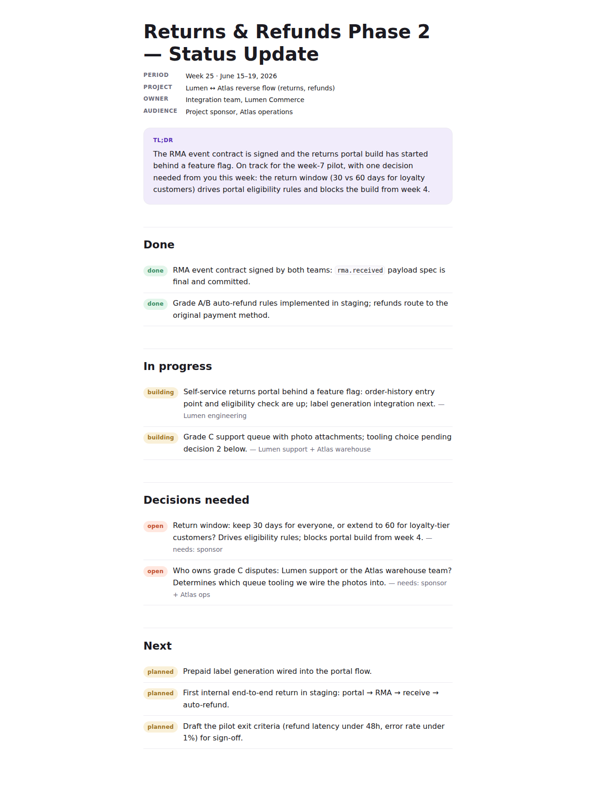 | 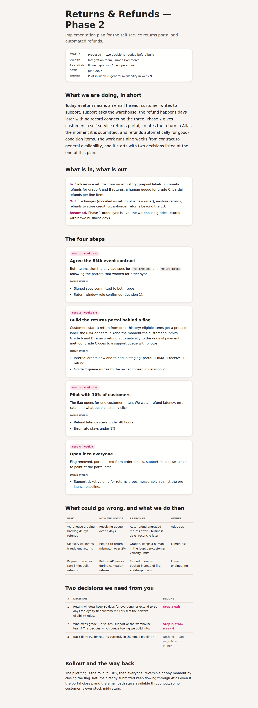 |
| 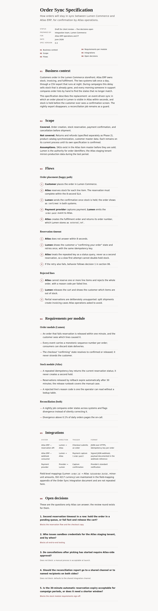 | 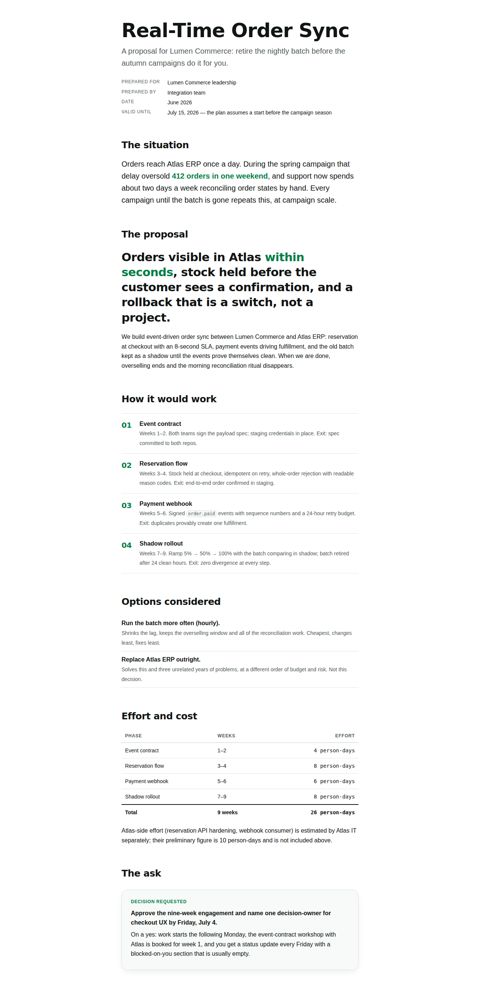 |
| 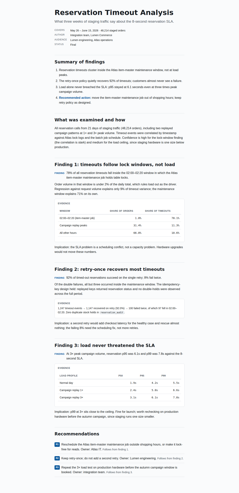 | 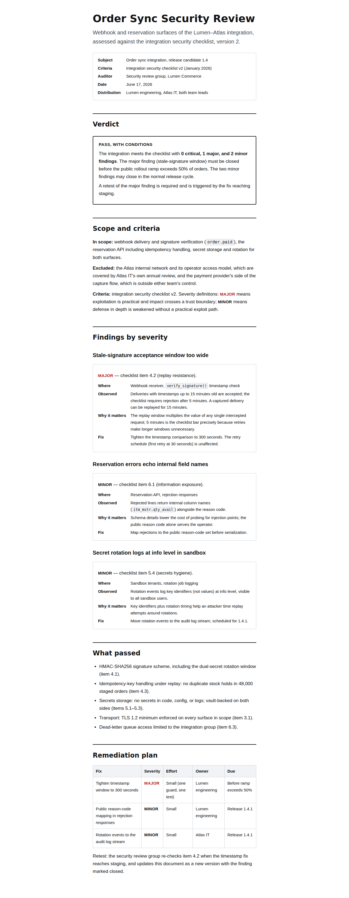 |
| 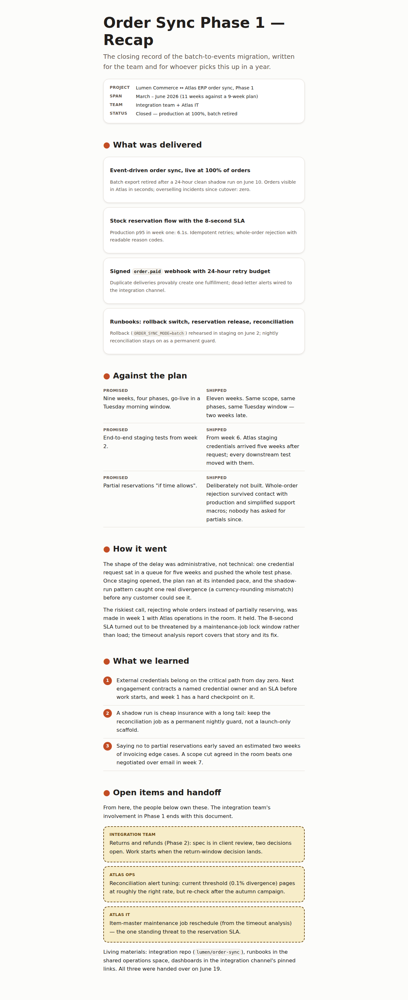 | 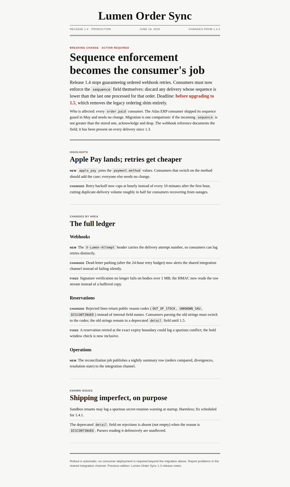 |

Every template renders in every style: CI builds the full 11 x 9 matrix and
fails on any error from `check-document.mjs`. The twelfth, `presentation`,
is assembled by scripts from a folder of pictures (room by room, with
variants to choose from and the products used, read from the shops' pages);
its own smoke test builds it in all nine styles.

## How brand works

`/letterhead teach` builds a brand profile from any sources you opt into: a
brand book PDF, your live site, design tokens already in the repo, or a
short interview. The profile is five files in `.letterhead/brand/`
(`DESIGN.md`, `PRODUCT.md`, `tokens.css`, `profile.meta.json`, and a
one-page `brand-sheet.html`). The brand sheet is the first thing you
publish, before the first document: whoever owns the brand comments on
what is not theirs, and the next version of the sheet lands at the same
link. Other brands live in `.letterhead/brands/<slug>/`; say "for Acme"
and the document ships in Acme's identity instead of yours. Every document
carries both themes: light and dark travel in the same file.

## Built for comments, by contract

Documents are made to collect comments, not just to be looked at:

- every section heading has a stable, content-derived id, so comments
  anchored to a section survive new versions of the document
- the title is extractable, metadata is labeled, and the file is fully
  self-contained
- `scripts/check-document.mjs` verifies all of it mechanically

## Publishing for comments

`/letterhead publish` sends a document to [Markloop](https://markloop.io).
Markloop turns an HTML document into one link people can comment on; your
AI pulls the comments and publishes the next version at the same link.

- **Publish.** Your agent uploads the document through Markloop's MCP
  tools. Publishing needs a Markloop account for you, the author (14-day
  trial, no card). Then you switch on commenting for the file's share link
  in Markloop (links are read-only until you do) and send that link to your
  team or clients.
- **Comment.** They open the link, type a name and comment on the exact
  line. No account on their side.
- **Update.** Your agent pulls the comments, each with the sentence it is
  about and the version it was made on, and uploads the next version of the
  same file. The share link always opens the latest version, so you never
  send a new link.

MCP works with Claude (chat, Cowork and Claude Code), ChatGPT (including
Codex), Cursor and Grok. Any other AI works through file upload, and the
comments come back as a feedback package of plain files you can hand to any
agent. If you do not use Markloop, the generated file is still a plain
self-contained HTML document you can share any way you like.

Third-party notices: [`letterhead/NOTICES.md`](letterhead/NOTICES.md).

## License

MIT. See [LICENSE](LICENSE).
