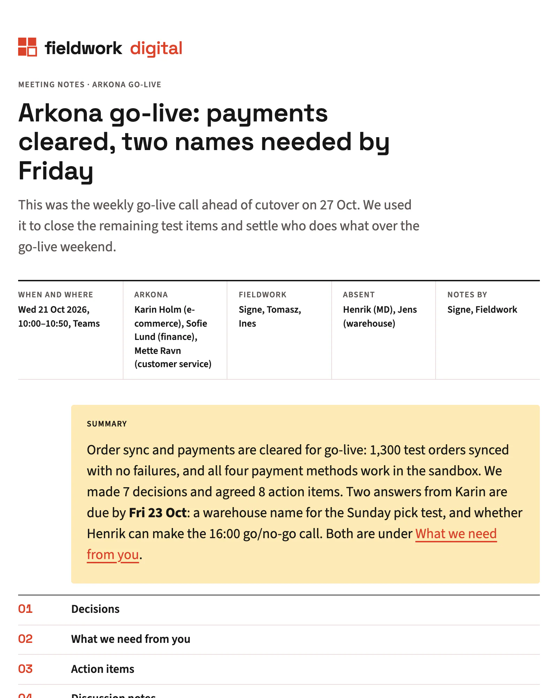
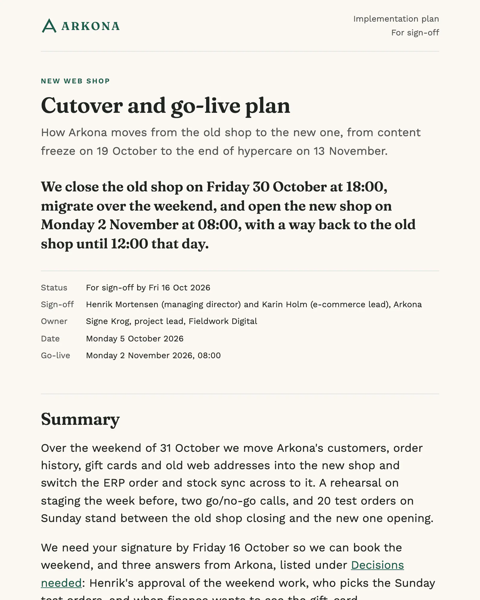
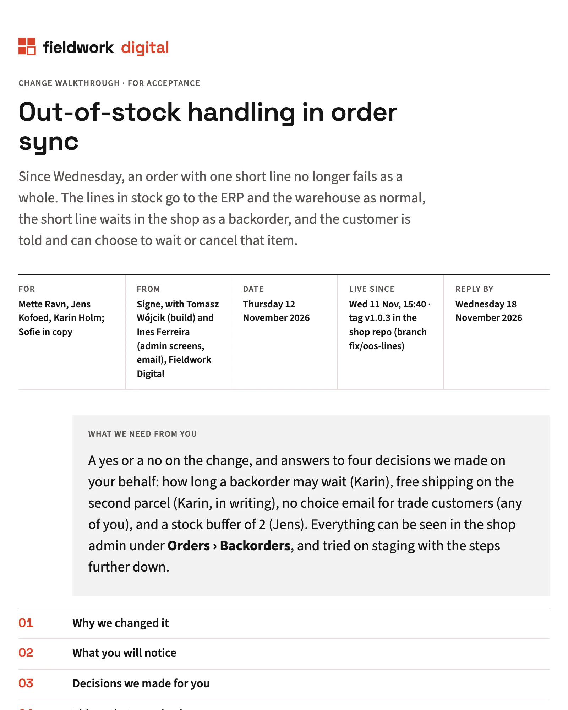
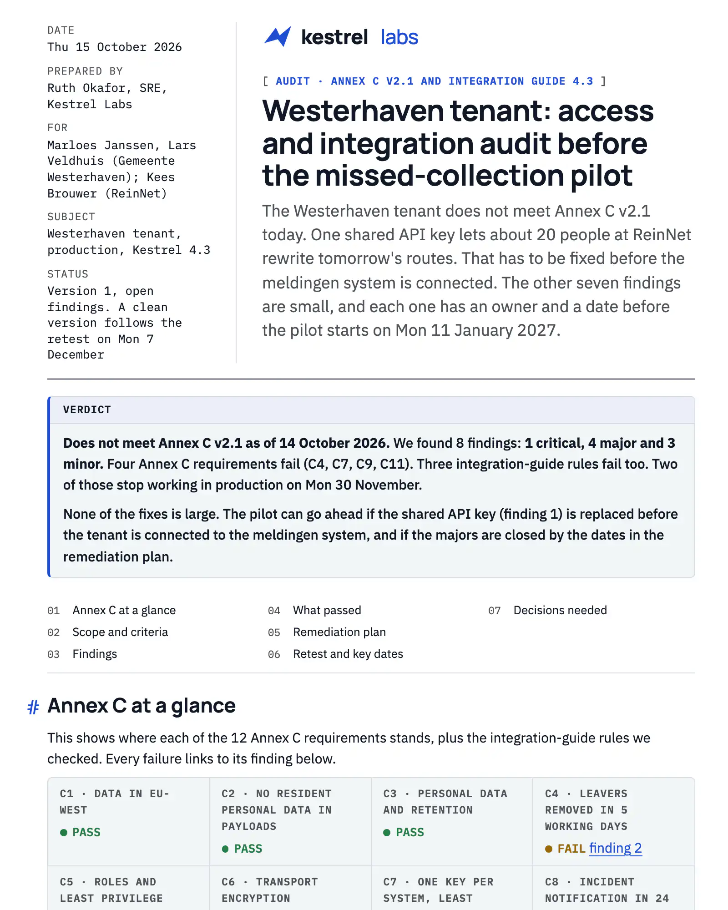
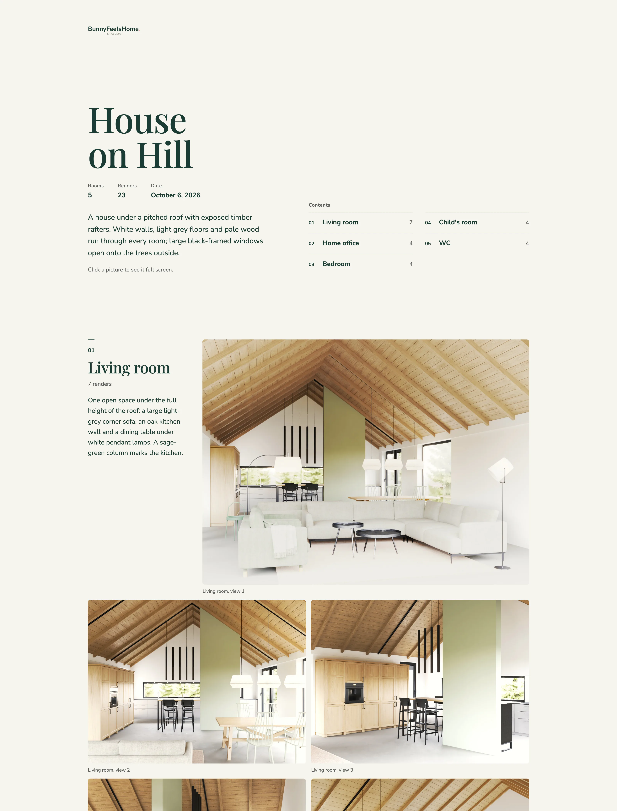

<h1>
  <picture>
    <source media="(prefers-color-scheme: dark)" srcset="examples/screenshots/hero-before-after-dark.webp">
    
  </picture>
</h1>

**Your agent writes the document. letterhead puts it on your client's letterhead.**

A skill for Claude (the app, Cowork and Claude Code), Codex, Cursor and other
agents. It turns notes, a repo or a conversation into one HTML file for
someone outside your team: a proposal, a status update, a plan, a
presentation of a project. It comes out in your client's brand (or yours),
reads well on a phone and prints cleanly. Publish it as a review link and
the client's comments carry over to version two.

**[Browse the live gallery →](https://mperlak.github.io/letterhead/)** 13 templates × 9 styles, light and dark.

---

## Install

**Claude app (desktop and web) and Cowork**

Download `letterhead.zip` from the
[latest release](https://github.com/mperlak/letterhead/releases/latest), then
in Claude open **Settings → Capabilities → Skills** and upload it. Code
execution has to be on. The app's sandbox may not reach the internet, so if
teaching a brand from a URL fails, give it the brand book PDF or a saved copy
of the page instead. Then just ask for a document.

**Claude Code**

```text
/plugin marketplace add mperlak/letterhead
/plugin install letterhead@letterhead
```

To get updates automatically, run `/plugin`, open **Marketplaces**, select
**letterhead** and choose **Enable auto-update** (Claude Code leaves it off
for third-party marketplaces).

**Codex**

```bash
codex plugin marketplace add mperlak/letterhead
codex plugin add letterhead@letterhead
```

**Cursor, OpenCode and other Agent Skills hosts**

```bash
npx skills add mperlak/letterhead
```

Or clone the repo and point your agent at `skills/letterhead/`. The scripts
need Node.js and nothing else; no npm install. Shrinking pictures for a
presentation uses `sips` (built into macOS), ImageMagick or Python with
Pillow when one is there; without them the pictures keep their size.

## Quick start

Talk to your agent the way you would talk to a colleague. The skill loads on
its own when you ask for a document or mention a brand.

```text
> learn the brand of https://arkona.example, it's my client
> make a status update for Arkona from NOTES.md
> polish status-update.html
```

1. **Brand, about two minutes.** The agent reads the site, proposes colors,
   fonts and logo, and waits for your yes. Then it shows a one-page
   **brand sheet**.
2. **Document.** Before writing anything, the agent shows the plan: template,
   brand, sections, what the first phone screen says. You say yes or change it.
3. **Done.** One `.html` file, light and dark inside, opens offline.

In Claude Code you can also type `/letterhead teach`, `/letterhead polish
<file>` or `/letterhead publish <file>` (`/letterhead:letterhead …` when
installed as a plugin).

<!-- TODO(asset): 60–90 s screen recording: URL → brand sheet → status update → a comment → version 2 at the same link. -->

## Why I built it

I run two companies. One is BunnyFeelsHome, an interior design studio. The other builds
agent systems for clients as a consultancy, which means a steady stream of
specs, proposals, plans and meeting notes going out the door.

Agents write most of those documents now, and the writing is fine. The
problem was the look. Every document came out different. Claude made one thing,
ChatGPT another, the same agent a third thing next week. None of it looked
like it came from my company, let alone like my client's.

I wanted something boring: teach the agent once what my brand looks like,
and what each client's brand looks like, and get a matching set of documents
every time, whichever agent wrote them. That is what letterhead does.

## What it makes

Thirteen templates, one per thing a client actually receives:

| Template | Use it for |
|---|---|
| `implementation-plan` | how a piece of work will be done, step by step |
| `status-update` | where a project stands this week |
| `meeting-notes` | decisions, action items with owners, what we need from you |
| `spec` | what will be built, for sign-off |
| `proposal` | an offer: scope, price, timeline |
| `report` | findings with evidence |
| `audit` | what was checked, what failed, what to fix |
| `project-recap` | what was delivered, at the end |
| `release-notes` | what changed in this version |
| `checklist` | steps someone else will tick off |
| `postmortem` | what went wrong and what changes now |
| `change-walkthrough` | a change explained to a non-author |
| `presentation` | a project shown picture by picture: rooms, variants, the products used |

Nine styles, chosen by who reads the document: `boardroom`, `engineering`,
`corporate`, `startup`, `consulting`, `public-sector`, `workshop`,
`atelier` (a small business writing to private customers) and `gazette`.
A style is a complete look: layout, type and color. A taught brand replaces
its colors, fonts and logo and keeps its layout.

One document for each of the twelve templates, for four fictional companies, each made by the
skill from short notes and left unedited:

<table>
  <tr>
    <td align="center" width="33%">
      <a href="https://mperlak.github.io/letterhead/documents/proposal--halde.html"><picture>
        <source media="(prefers-color-scheme: dark)" srcset="examples/screenshots/proposal--halde-dark.webp">
        
      </picture></a><br>
      <b>Proposal with packages and prices</b><br>
      <sub>Studio Halde · interior studio to a private client · atelier</sub>
    </td>
    <td align="center" width="33%">
      <a href="https://mperlak.github.io/letterhead/documents/report--halde.html"><picture>
        <source media="(prefers-color-scheme: dark)" srcset="examples/screenshots/report--halde-dark.webp">
        
      </picture></a><br>
      <b>Site survey report</b><br>
      <sub>Studio Halde · findings and a € range · gazette</sub>
    </td>
    <td align="center" width="33%">
      <a href="https://mperlak.github.io/letterhead/documents/status-update--arkona.html"><picture>
        <source media="(prefers-color-scheme: dark)" srcset="examples/screenshots/status-update--arkona-dark.webp">
        
      </picture></a><br>
      <b>Weekly status update</b><br>
      <sub>Arkona, written by its agency · consulting</sub>
    </td>
  </tr>
  <tr>
    <td align="center" width="33%">
      <a href="https://mperlak.github.io/letterhead/documents/meeting-notes--fieldwork.html"><picture>
        <source media="(prefers-color-scheme: dark)" srcset="examples/screenshots/meeting-notes--fieldwork-dark.webp">
        
      </picture></a><br>
      <b>Meeting notes with action items</b><br>
      <sub>Fieldwork Digital · decisions and owners · consulting</sub>
    </td>
    <td align="center" width="33%">
      <a href="https://mperlak.github.io/letterhead/documents/implementation-plan--arkona.html"><picture>
        <source media="(prefers-color-scheme: dark)" srcset="examples/screenshots/implementation-plan--arkona-dark.webp">
        
      </picture></a><br>
      <b>Cutover and go-live plan</b><br>
      <sub>Arkona · a plan to sign off · boardroom</sub>
    </td>
    <td align="center" width="33%">
      <a href="https://mperlak.github.io/letterhead/documents/checklist--arkona.html"><picture>
        <source media="(prefers-color-scheme: dark)" srcset="examples/screenshots/checklist--arkona-dark.webp">
        
      </picture></a><br>
      <b>Go-live weekend checklist</b><br>
      <sub>Arkona · owners and sign-offs · workshop</sub>
    </td>
  </tr>
  <tr>
    <td align="center" width="33%">
      <a href="https://mperlak.github.io/letterhead/documents/project-recap--fieldwork.html"><picture>
        <source media="(prefers-color-scheme: dark)" srcset="examples/screenshots/project-recap--fieldwork-dark.webp">
        
      </picture></a><br>
      <b>Project recap</b><br>
      <sub>Fieldwork Digital · results at the end · startup</sub>
    </td>
    <td align="center" width="33%">
      <a href="https://mperlak.github.io/letterhead/documents/change-walkthrough--fieldwork.html"><picture>
        <source media="(prefers-color-scheme: dark)" srcset="examples/screenshots/change-walkthrough--fieldwork-dark.webp">
        
      </picture></a><br>
      <b>Change walkthrough for acceptance</b><br>
      <sub>Fieldwork Digital · what changed, how to check · consulting</sub>
    </td>
    <td align="center" width="33%">
      <a href="https://mperlak.github.io/letterhead/documents/audit--kestrel.html"><picture>
        <source media="(prefers-color-scheme: dark)" srcset="examples/screenshots/audit--kestrel-dark.webp">
        
      </picture></a><br>
      <b>Access and integration audit</b><br>
      <sub>Kestrel Labs · findings by severity · engineering</sub>
    </td>
  </tr>
  <tr>
    <td align="center" width="33%">
      <a href="https://mperlak.github.io/letterhead/documents/spec--kestrel.html"><picture>
        <source media="(prefers-color-scheme: dark)" srcset="examples/screenshots/spec--kestrel-dark.webp">
        
      </picture></a><br>
      <b>Product spec for sign-off</b><br>
      <sub>Kestrel Labs · B2B software · engineering</sub>
    </td>
    <td align="center" width="33%">
      <a href="https://mperlak.github.io/letterhead/documents/release-notes--kestrel.html"><picture>
        <source media="(prefers-color-scheme: dark)" srcset="examples/screenshots/release-notes--kestrel-dark.webp">
        
      </picture></a><br>
      <b>Release notes with breaking changes</b><br>
      <sub>Kestrel Labs · corporate</sub>
    </td>
    <td align="center" width="33%">
      <a href="https://mperlak.github.io/letterhead/documents/postmortem--kestrel.html"><picture>
        <source media="(prefers-color-scheme: dark)" srcset="examples/screenshots/postmortem--kestrel-dark.webp">
        
      </picture></a><br>
      <b>Incident postmortem for a client</b><br>
      <sub>Kestrel Labs · public-sector</sub>
    </td>
  </tr>
</table>

Every brand above was taught from its website in about a minute. The notes,
the prompts and the HTML of every document are in
[`examples/`](examples/).

### A project, picture by picture

Give it a folder of pictures, one subfolder per room, and it builds the
presentation: a cover with the contents, then each room with its text and
its pictures, full screen on a click. This one is a real project from my
studio, House on Hill by [BunnyFeelsHome](https://bunnyfeelshome.com): 23 renders in
five rooms, the products under each room linked to their shops, brand taught
from the live site, the whole thing in a few minutes.

<p align="center"><a href="https://mperlak.github.io/letterhead/documents/presentation--bunnyfeelshome.html"><picture>
  <source media="(prefers-color-scheme: dark)" srcset="examples/screenshots/presentation--bunnyfeelshome-wide-dark.webp">
  
</picture></a></p>

## Teach it a brand

```text
You:    learn the brand of https://arkona.example
Agent:  → reads the page and its stylesheets
        → counts which colors sit on buttons, links and navigation
        → reads the font rules and saves the logo from the header
        → proposes: primary, fonts, logo, closest style, open questions
You:    yes, but use the dark logo
Agent:  → writes .letterhead/brands/arkona/ and opens the brand sheet
```

Every value records where it came from and how sure the agent is; when
something is missing, it asks rather than picking a random color. A brand
book PDF, HTML files or a short interview work as sources too.

**The brand sheet** shows the colors, fonts and logo with their sources and
the agent's open questions. Send it to whoever owns the brand before the
first document, so a wrong blue gets fixed on one page, not in a
twenty-page spec.

<p align="center"><picture>
  <source media="(prefers-color-scheme: dark)" srcset="examples/screenshots/brand-sheet--halde-dark.webp">
  
</picture></p>

**One profile per client.** Say "for Arkona" and the document ships in
Arkona's identity; your own brand is the default.

## Sending it to a client

- **As a file.** Attach the `.html` to an email. It opens in any browser,
  offline, with nothing to install. A presentation with many pictures can be
  8–10 MB.
- **As a PDF.** Open it in a browser and print to PDF. Every style has print
  rules; check the print preview before you send it.
- **As a link people comment on.** `/letterhead publish` sends it to
  [Markloop](https://markloop.io) (a paid service from the author of this
  skill; you need an account and its connector in your agent): the client
  comments on the exact line without an account, your agent pulls the
  comments and uploads version two to the same link. Every section heading
  keeps a stable id, so a comment on "Timeline" stays on "Timeline" in
  version two. Any other host works too; you just lose the
  comment loop.

## What runs on your machine, and what leaves it

The skill is Node.js scripts that run wherever your agent runs code: no npm
install, no telemetry, no account (publishing to Markloop needs one). Your
notes and the document go to whichever model your agent uses, as with
anything you ask it. Beyond that, three things touch the network, and only
when you ask for them:

- **teach** reads the website you give it (the page, its stylesheets, the
  logo) and downloads the brand's fonts from Google Fonts so they can be
  embedded. Give it a brand book PDF or font files instead and it stays
  offline.
- **Product cards** in a presentation read the shop pages you link and
  download the product photos.
- **publish** uploads the document to Markloop.

Writing and checking a document needs no network at all.

## When not to use it

- **Slides for a talk.** Use a slides skill such as
  [frontend-slides](https://github.com/zarazhangrui/frontend-slides).
  letterhead's `presentation` template is for showing a project picture by
  picture, not for a keynote.
- **A diagram on its own.** Use
  [diagram-design](https://github.com/cathrynlavery/diagram-design).
- **A landing page or app UI.** letterhead makes documents, so use a
  frontend skill.
- **The recipient must edit a Word or PowerPoint file.** letterhead writes
  HTML.

## How it is checked

Every document the agent writes goes through `check-document.mjs`: one
file, no external requests, a title, labeled metadata, stable section ids,
readable text contrast, the brand's colors checked for contrast in both
themes, none of the usual AI tells (gradient
text, an icon on every heading, a "Generated by AI" footer). CI runs the
same check on every template in every style. If a document of yours fails
it, please [open an issue](https://github.com/mperlak/letterhead/issues).

## Contributing

Templates live in `letterhead/templates/<name>/template.md`, styles in
`letterhead/styles/<name>/`. Edit only `letterhead/`; `bin/sync-mounts.sh`
copies it to `skills/letterhead/`. [AGENTS.md](AGENTS.md) has the full
workflow.

## License

MIT. See [LICENSE](LICENSE) and [`letterhead/NOTICES.md`](letterhead/NOTICES.md).

---

Made by **Marcin Perlak**. <!-- TODO(marcin): link to X / site --> If
letterhead saved you an evening, star the repo.
