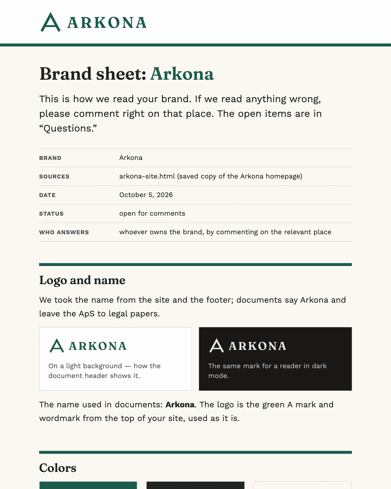
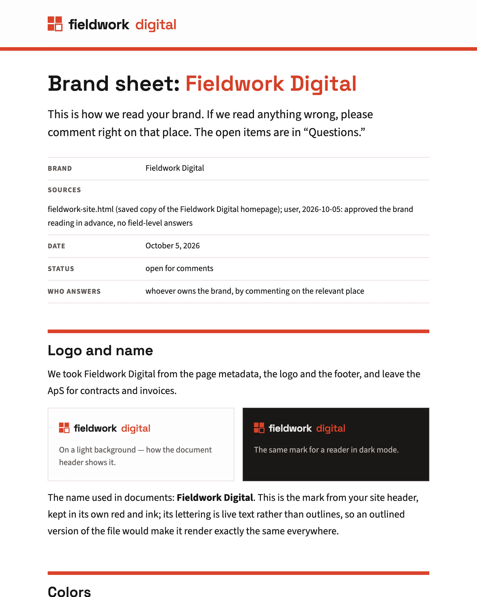
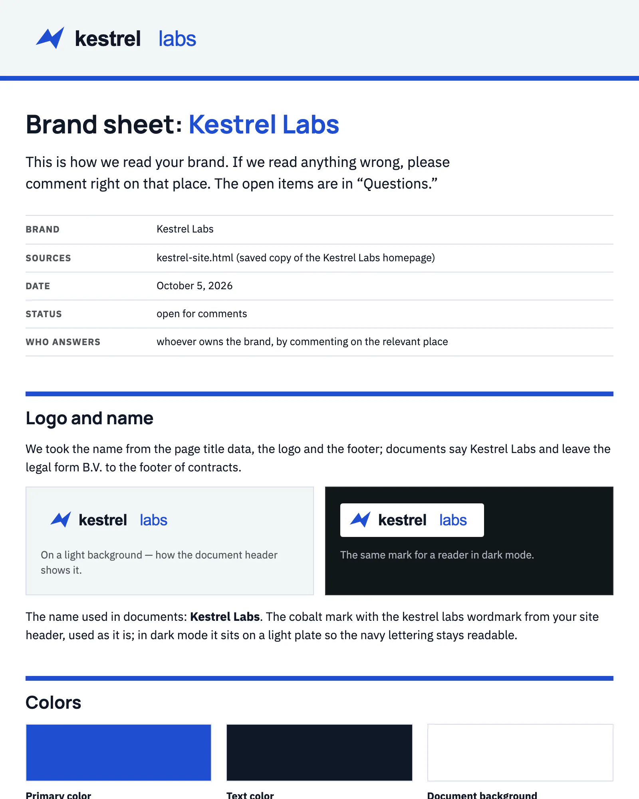

<!-- Generated by dev-scripts/screenshots.mjs --grid. Paste into README.md.
     Image paths are relative to this file: adjust them (e.g. examples/screenshots/) where you paste. -->
<table>
  <tr>
    <td align="center" width="33%">
      <a href="https://mperlak.github.io/letterhead/documents/checklist--arkona.html"><picture>
        <source media="(prefers-color-scheme: dark)" srcset="checklist--arkona-dark.webp">
        
      </picture></a> 
      <b>Arkona go-live weekend checklist, 29 Oct</b> 
      Checklist · arkona brand
    </td>
    <td align="center" width="33%">
      <a href="https://mperlak.github.io/letterhead/documents/implementation-plan--arkona.html"><picture>
        <source media="(prefers-color-scheme: dark)" srcset="implementation-plan--arkona-dark.webp">
        
      </picture></a> 
      <b>Arkona web shop</b> 
      Implementation plan · arkona brand
    </td>
    <td align="center" width="33%">
      <a href="https://mperlak.github.io/letterhead/documents/postmortem--kestrel.html"><picture>
        <source media="(prefers-color-scheme: dark)" srcset="postmortem--kestrel-dark.webp">
        
      </picture></a> 
      <b>Routes not published by 05:00 on Tue 22 Sep 2026</b> 
      Postmortem · kestrel brand
    </td>
  </tr>
  <tr>
    <td align="center" width="33%">
      <a href="https://mperlak.github.io/letterhead/documents/project-recap--fieldwork.html"><picture>
        <source media="(prefers-color-scheme: dark)" srcset="project-recap--fieldwork-dark.webp">
        
      </picture></a> 
      <b>Saltværk new shop</b> 
      Project recap · fieldwork brand
    </td>
    <td align="center" width="33%">
      <a href="https://mperlak.github.io/letterhead/documents/proposal--fieldwork.html"><picture>
        <source media="(prefers-color-scheme: dark)" srcset="proposal--fieldwork-dark.webp">
        
      </picture></a> 
      <b>Arkona phase 2</b> 
      Proposal · fieldwork brand
    </td>
    <td align="center" width="33%">
      <a href="https://mperlak.github.io/letterhead/documents/proposal--halde.html"><picture>
        <source media="(prefers-color-scheme: dark)" srcset="proposal--halde-dark.webp">
        
      </picture></a> 
      <b>Your duplex on the Bilderdijkkade</b> 
      Proposal · halde brand
    </td>
  </tr>
  <tr>
    <td align="center" width="33%">
      <a href="https://mperlak.github.io/letterhead/documents/release-notes--kestrel.html"><picture>
        <source media="(prefers-color-scheme: dark)" srcset="release-notes--kestrel-dark.webp">
        
      </picture></a> 
      <b>Kestrel 4.3 release notes</b> 
      Release notes · kestrel brand
    </td>
    <td align="center" width="33%">
      <a href="https://mperlak.github.io/letterhead/documents/report--halde.html"><picture>
        <source media="(prefers-color-scheme: dark)" srcset="report--halde-dark.webp">
        
      </picture></a> 
      <b>Survey report</b> 
      Report · halde brand
    </td>
    <td align="center" width="33%">
      <a href="https://mperlak.github.io/letterhead/documents/spec--kestrel.html"><picture>
        <source media="(prefers-color-scheme: dark)" srcset="spec--kestrel-dark.webp">
        
      </picture></a> 
      <b>Missed-collection reports to same-day return trips</b> 
      Spec · kestrel brand
    </td>
  </tr>
  <tr>
    <td align="center" width="33%">
      <a href="https://mperlak.github.io/letterhead/documents/status-update--arkona.html"><picture>
        <source media="(prefers-color-scheme: dark)" srcset="status-update--arkona-dark.webp">
        
      </picture></a> 
      <b>Arkona webshop and ERP order sync</b> 
      Status update · arkona brand
    </td>
    <td align="center" width="33%">
      <a href="https://mperlak.github.io/letterhead/brands/arkona.html"><picture>
        <source media="(prefers-color-scheme: dark)" srcset="brand-sheet--arkona-dark.webp">
        
      </picture></a> 
      <b>Brand sheet: Arkona</b> 
      Brand sheet · Arkona
    </td>
    <td align="center" width="33%">
      <a href="https://mperlak.github.io/letterhead/brands/fieldwork.html"><picture>
        <source media="(prefers-color-scheme: dark)" srcset="brand-sheet--fieldwork-dark.webp">
        
      </picture></a> 
      <b>Brand sheet: Fieldwork Digital</b> 
      Brand sheet · Fieldwork
    </td>
  </tr>
  <tr>
    <td align="center" width="33%">
      <a href="https://mperlak.github.io/letterhead/brands/halde.html"><picture>
        <source media="(prefers-color-scheme: dark)" srcset="brand-sheet--halde-dark.webp">
        
      </picture></a> 
      <b>Brand sheet: Studio Halde</b> 
      Brand sheet · Halde
    </td>
    <td align="center" width="33%">
      <a href="https://mperlak.github.io/letterhead/brands/kestrel.html"><picture>
        <source media="(prefers-color-scheme: dark)" srcset="brand-sheet--kestrel-dark.webp">
        
      </picture></a> 
      <b>Brand sheet: Kestrel Labs</b> 
      Brand sheet · Kestrel
    </td>
    <td width="33%"></td>
  </tr>
</table>
